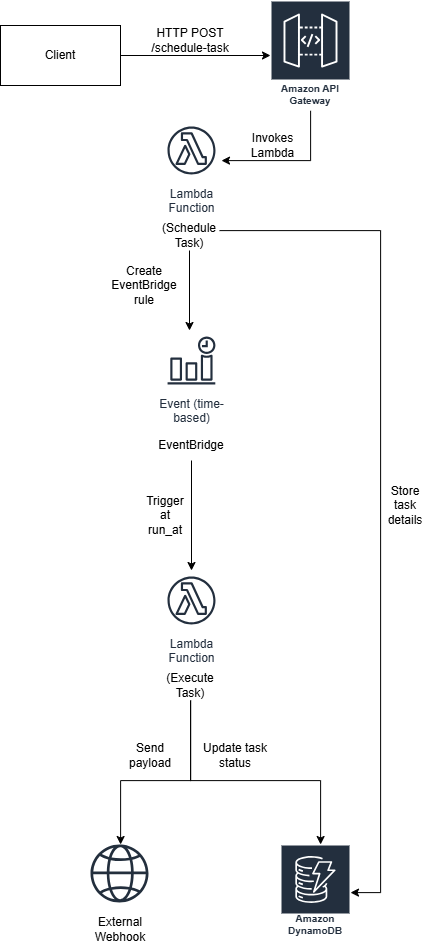

# 🛠️ Serverless Task Scheduler

A simple, event-driven **serverless task scheduler** using **AWS Lambda**, **API Gateway**, **DynamoDB**, and **EventBridge**. Tasks can be scheduled via an HTTP API to run at a future time.

---

## 🧱 Architecture / Design

  

---

## ⚙️ How It Works

1. Client sends a **POST** request to `/schedule-task` with the payload:
   - `action` (e.g., `"webhook"`)
   - `payload` (e.g., message body)
   - `run_at` (ISO8601 UTC timestamp or cron expression)

2. **API Gateway** triggers Lambda (1) `schedule_task/app.py`.

3. Lambda (1):
   - Stores the task in **DynamoDB**
   - Creates a one-time **EventBridge** rule for the `run_at` time

4. At the scheduled time, **EventBridge** triggers Lambda (2) `execute_task/app.py`.

5. Lambda (2):
   - Executes the action (e.g., sends POST to a webhook)
   - Updates task status in **DynamoDB**

---

## 🧪 Deploy & Test Locally

### 🔧 Prerequisites:

- Python 3.9 installed
- Docker installed and running
- AWS CLI configured (`aws configure`)
- AWS SAM CLI installed

---

### 🚀 Setup

```bash
# Navigate to project root
cd task_scheduler

# Build the project
sam build

# Deploy (guided mode)
sam deploy --guided
```

> Follow the prompts to set stack name, region, and save the config for next time.

---

## 📬 Example API Request

**Endpoint:** `POST /schedule-task`

```bash
curl --location 'https://z81b2sjbqk.execute-api.ap-south-1.amazonaws.com/Prod/schedule-task' \
--header 'Content-Type: application/json' \
--data '{
  "action": "webhook",
  "payload": {
    "url": "https://webhook.site/96599b9f-923b-48d7-9a6d-b4682701ba96",
    "data": { "msg": "Hello from Lambda" }
  },
  "run_at": "2025-05-19T17:56:00Z"
}'
```

---

### ✅ Expected Response

```json
{
  "message": "Task scheduled successfully",
  "task_id": "123e4567-e89b-12d3-a456-426614174000",
  "status": "scheduled",
  "run_at": "2025-05-19T17:56:00Z"
}
```

- `task_id` will be a unique UUID.
- This indicates the task is stored in **DynamoDB** and an **EventBridge** rule has been created.

---

## 📝 Notes

- `run_at` must be in the future in ISO8601 UTC or **Cron** expression.
  - Example:  
    ```json
    "run_at": "cron(03 18 19 5 ? 2025)"
    ```
- DynamoDB stores task status: `scheduled`, `completed`, `failed`.
- Add **retry logic** or **DLQ (Dead Letter Queue)** as needed for production.
- Monitor and log using **CloudWatch**.

---

## 🔐 IAM Permissions Setup

To test this project successfully, your IAM user or role should have at least:

- `lambda:InvokeFunction`
- `dynamodb:PutItem`, `GetItem`, `UpdateItem`, `Query`
- `events:PutRule`, `PutTargets`, `DeleteRule`, `RemoveTargets`
- `apigateway:*` (if deploying API Gateway resources)
- `cloudwatch:PutLogs`

---

## 🔒 License & Usage

This project is intended **strictly for evaluation purposes** related to a job application.

**Please do not copy, reuse, or distribute this code** without explicit permission from the author.
